### Toolkit

### Currently building

- **Safe RGB-D perception for grasping.** Corruption detection and per-pixel confidence gating in PyBullet. Cut wrong-motion executions on bad depth from 43% to 17% at 84.9 ms p95.
- **Dynamic-object masking for Visual SLAM.** YOLOv8 / YOLO-Nano + ORB-SLAM3 & OpenVINS on TUM RGB-D, measuring the accuracy vs FPS trade-off.

### Publications

- [*Robotic-Assisted CABG: A Comprehensive Review* · ACM, AIR 2025 (IIT Jodhpur)](https://dl.acm.org/doi/10.1145/3787370.3787406)
- [*Enhanced Payload Fairing Design: Integrating CFRP and GFRP* · Springer LNME, ICMech REC'24. Got Best Paper](https://link.springer.com/book/10.1007/978-981-96-7576-0)

## Beyond robotics

In my world parallel with robotics, you can find me writing poems, reflections, musings, exploring nerdy topics (especially astronomy) or dancing!

### Connect

